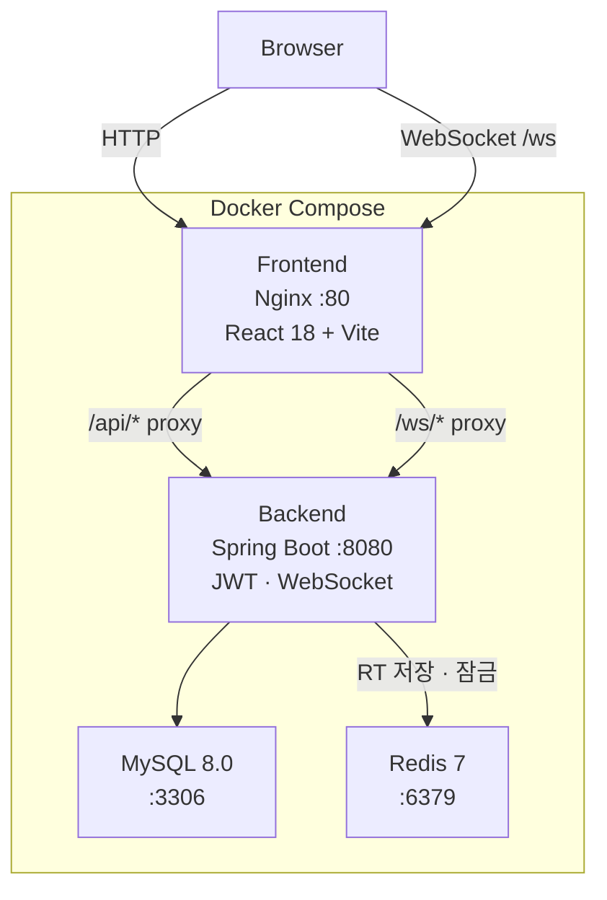
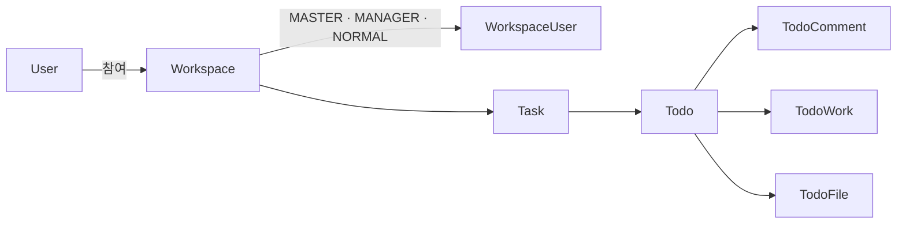
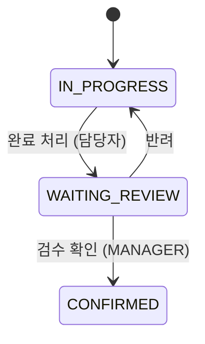

# Collabus

> 팀 협업 작업 관리 플랫폼 — Workspace · Task · Todo 계층 구조 기반

---

## Demo

> 로그인 → 대시보드 → 워크스페이스 → Task → Todo 확인 → 검수 승인 → 담당자 변경 → 멤버 관리


---

## Architecture



### 도메인 계층



### Todo 상태 흐름



---

## Tech Stack

| Layer | Stack |
|-------|-------|
| Backend | Java 21 · Spring Boot 3 · Spring Security · JWT · WebSocket (STOMP) |
| Frontend | React 18 · Vite · React Router v6 · TanStack Query · Zustand · Tailwind CSS |
| Database | MySQL 8.0 |
| Cache | Redis 7 — Refresh Token · 로그인 실패 횟수 · 블랙리스트 |
| Infra | Docker · Docker Compose · Nginx |

---

## Test Accounts

더미 데이터가 자동으로 삽입됩니다. 아래 계정으로 바로 로그인 가능합니다.

| 이메일 | 비밀번호 | 소속 워크스페이스 |
|--------|---------|-----------------|
| `user1@test.com` | `password` | 마케팅팀 (MASTER) · 개발팀 (MASTER) · 디자인팀 (MASTER) |
| `user2@test.com` | `password` | 마케팅팀 (MASTER) |
| `user3@test.com` | `password` | 마케팅팀 (MANAGER) |
| `user5@test.com` | `password` | 개발팀 (MASTER) |
| `user8@test.com` | `password` | 디자인팀 (MASTER) |
| `admin@collabus.com` | `password` | - |

> `user1` ~ `user10` 모두 비밀번호 `password` 동일

---

## Quick Start

### Docker (권장)

```bash
# 1. 환경변수 설정
cp .env.example .env

# 2. 실행
docker compose up --build -d

# 3. 종료
docker compose down
```

| 서비스 | URL |
|--------|-----|
| 앱 | http://localhost |
| API | http://localhost:8080 |
| Swagger | http://localhost:8080/swagger-ui/index.html |

### 로컬 개발

> **주의**: 로컬 개발 환경에서도 **Redis와 MySQL이 반드시 실행 중이어야 합니다.**  
> 간단하게는 Docker Compose로 DB만 먼저 띄운 뒤 백엔드를 로컬에서 실행할 수 있습니다.

```bash
# MySQL, Redis만 컨테이너로 실행
docker compose up -d mysql redis

# 백엔드
cp .env.example .env
./gradlew bootRun --args='--spring.profiles.active=docker'

# 프론트엔드
cd frontend
npm install && npm run dev
```

---

## Environment Variables

**`.env` (루트)** — `.env.example` 복사 후 바로 사용 가능

```env
JWT_SECRET=collabus-dev-secret-key-for-local-testing-only-32chars
JWT_EXPIRATION=900000          # Access Token TTL (ms) — 기본 15분
JWT_REFRESH_EXPIRATION=604800000  # Refresh Token TTL (ms) — 기본 7일

DB_NAME=collabus
DB_USERNAME=collabus
DB_PASSWORD=collabus1234
DB_ROOT_PASSWORD=rootpassword1234

REDIS_HOST=localhost
REDIS_PORT=6379
```

---

## Project Structure

```
Collabus/
├── src/main/java/com/muscat/Collabus/
│   ├── User/           # 회원 인증 · 로그인 · Brute Force 방어
│   ├── Workspace/      # 워크스페이스 CRUD
│   ├── WorkspaceUser/  # 멤버 · 초대 · 역할 관리
│   ├── Task/           # Task CRUD · 참여자 관리
│   ├── Todo/           # Todo · Comment · Work · File
│   ├── Notification/   # 실시간 알림 (WebSocket)
│   └── config/
│       ├── jwt/        # JWT 발급 · 검증
│       ├── security/   # Spring Security · CORS
│       ├── token/      # Refresh Token · Blacklist · Rate Limit
│       └── websocket/  # STOMP · 인증 인터셉터
├── frontend/src/
│   ├── api/            # Axios 클라이언트 · 도메인별 API
│   ├── pages/          # Dashboard · Workspace · Task · Todo · Profile
│   ├── components/     # Layout · Sidebar · Toast · Notification
│   ├── hooks/          # useAuth · useWorkspace · useTask · useTodo
│   └── store/          # authStore · toastStore
├── docker-compose.yml
├── Dockerfile
└── frontend/
    ├── Dockerfile
    └── nginx.conf
```

---

## Security

| 항목 | 구현 |
|------|------|
| 인증 | JWT Access Token (15분) + Refresh Token (7일) |
| Refresh Token Rotation | 재발급 시마다 새 RT 발급, 기존 RT 무효화 |
| 로그아웃 | Access Token 블랙리스트 등록 (Redis) |
| Brute Force 방어 | 5회 실패 시 10분 계정 잠금 (Redis) |
| 비밀번호 정책 | 8자 이상, 영문 + 숫자 필수 |
| 비밀번호 변경 | 변경 즉시 기존 RT 무효화 → 타 기기 세션 강제 종료 |
| WebSocket 인증 | STOMP CONNECT 프레임에서 JWT 검증 |
